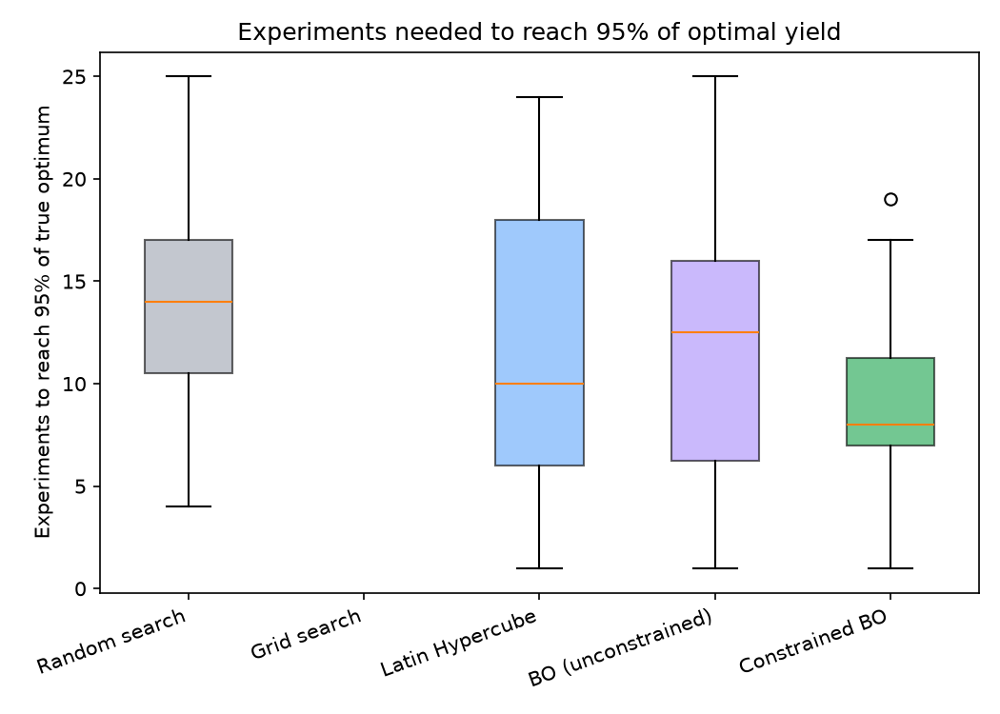
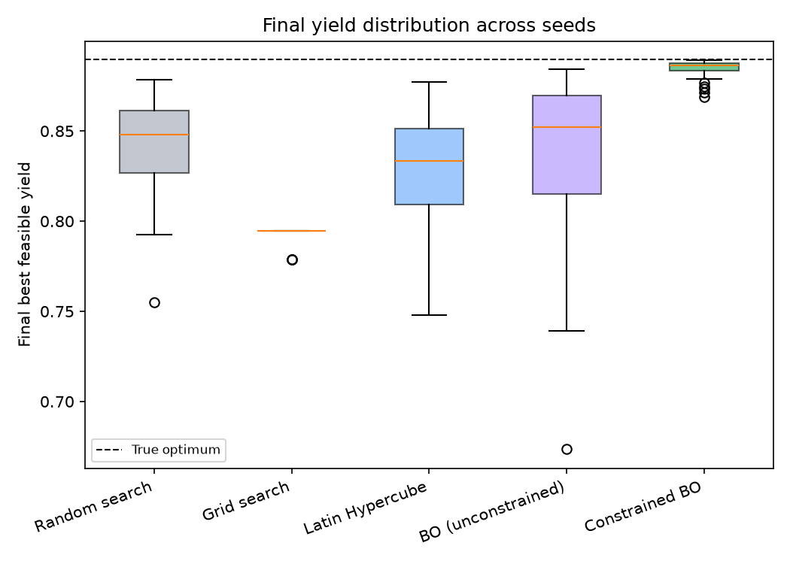
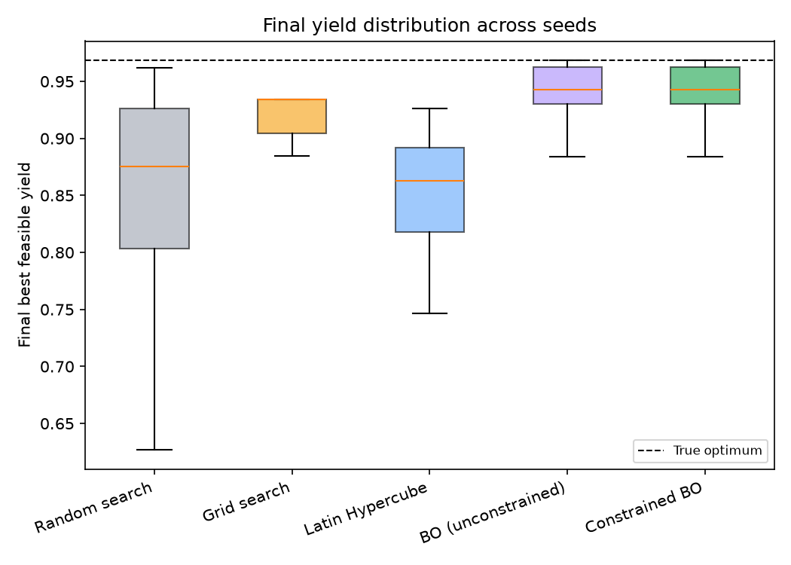

<p align="center">
  
</p>

# Titrate

**Constrained Bayesian optimization for chemical process design — how many experiments does it actually take to find a near-optimal reaction condition?**

**[🔗 Live demo — titrate.streamlit.app](https://titrate.streamlit.app/)** — interactive: swap between the physics simulator and real reaction data, adjust engineering constraints, or upload your own CSV. See [§14](#14-demo).

Titrate is an open-source benchmark and optimization engine for the small-data experiment-design problem at the core of AI-native chemistry/process-R&D companies: given a limited number of experiments, which condition should you run next to reach the best (feasible) outcome as fast as possible? It implements Gaussian-process-based constrained Bayesian optimization from scratch on top of a physically grounded chemical reactor model, and rigorously benchmarks it against random search, grid search, and Latin Hypercube Sampling across 40 random seeds — then validates the same method on a real published chemistry dataset (see [§9](#9-real-data-validation)).

**Headline result:** on a constrained CSTR yield-optimization problem with a genuine interior optimum, constrained BO reaches 95% of the true optimal yield in a median of **8 experiments**, versus **14 for random search** and **10 for Latin Hypercube Sampling** — while also violating the process's purity constraint less often than any other strategy tested.


*Median best-feasible yield found so far vs. experiments performed, across 40 random seeds (shaded = interquartile range). Constrained BO (green) separates from every baseline by experiment ~7 and tracks the true optimum (dashed line) by experiment 25. Full numbers in [§8](#8-results), generated by [`experiments/run_benchmark.py`](experiments/run_benchmark.py) — nothing on this page is hand-typed.*

> **Data:** the primary benchmark above uses a physics-based CSTR simulator — clearly labeled as simulated throughout. [§9](#9-real-data-validation) then re-runs the same method on 96 real published Suzuki-Miyaura reaction measurements. See [§10](#10-data) for exactly what "simulated" means and why, and [§9](#9-real-data-validation) for the real-data provenance.

---

## Why this is relevant to industry

- **Reaction optimization:** the exact loop AI-native process-chemistry startups build — small amounts of HTE/flow data, a surrogate with calibrated uncertainty, and a policy for the next experiment — applied here to a real reaction-condition search problem, not a toy function.
- **Materials & formulation R&D:** the same constrained-BO machinery (GP surrogate + feasibility-aware acquisition) applies directly to composition/formulation search under cost or safety limits, a near-identical mathematical structure to what's implemented here.
- **Process-development experiment planning:** the core question — *which condition should we run next, and how many runs until we're confident we're near-optimal* — is the standard planning question in scale-up and process development, answered here quantitatively rather than by intuition.

---

## Table of contents

1. [The problem](#1-the-problem)
2. [Why it matters](#2-why-it-matters)
3. [ChemE formulation](#3-cheme-formulation)
4. [Physics](#4-physics)
5. [ML approach](#5-ml-approach)
6. [Optimization approach](#6-optimization-approach)
7. [Benchmark methodology](#7-benchmark-methodology)
8. [Results](#8-results)
9. [Real-data validation](#9-real-data-validation)
10. [Data](#10-data)
11. [Limitations](#11-limitations)
12. [Reproducing this](#12-reproducing-this)
13. [Repository layout](#13-repository-layout)
14. [Demo](#14-demo)
15. [Future work](#15-future-work)

---

## 1. The problem

Given a chemical reaction run in a continuous stirred-tank reactor (CSTR), find the operating conditions — temperature, residence time, catalyst loading — that maximize product yield, subject to a hard purity specification, using as few experiments as possible.

Each "experiment" is expensive (time, material, instrument access), so the question that matters isn't just *what's the best condition* but *how many experiments does it take to find it*. That's the question this repository answers, quantitatively, with real numbers and real baselines.

## 2. Why it matters

This is the core technical loop behind AI-native chemistry and process-R&D startups (autonomous experimentation / self-driving-lab platforms, reaction-condition optimization tools, materials-discovery pipelines): small amounts of experimental data, a surrogate model with calibrated uncertainty, and a policy for choosing the next experiment under real engineering constraints. Titrate builds that loop end-to-end — physics, surrogate, acquisition, constraints, benchmark — rather than any one piece of it in isolation.

## 3. ChemE formulation

**Reaction network** (liquid phase, steady-state CSTR, first-order parallel reactions):

- A → B (desired product), rate constant k₁(T, C_cat)
- A → C (undesired byproduct), rate constant k₂(T)

The two pathways have different activation energies (Ea₂ > Ea₁), so raising temperature always speeds up both reactions but erodes **selectivity** toward the desired product — temperature is not simply "more is better." Catalyst loading selectively promotes only the desired pathway (Langmuir-type saturation — diminishing returns at high loading). Residence time controls **conversion**. This is what makes the yield surface genuinely non-trivial: the optimal temperature depends on how much residence time and catalyst you're allowed to use, not just on temperature in isolation.

**Optimization problem:**

```
maximize   Y(T, τ, C_cat) = conversion × selectivity
subject to T_min ≤ T ≤ T_max            (safety / material limits)
           τ_min ≤ τ ≤ τ_max            (reactor size / throughput cost)
           0 ≤ C_cat ≤ C_cat,max         (catalyst cost)
           C_impurity(T, τ, C_cat) ≤ C_impurity,max   (product purity spec)
```

The impurity constraint is *not* a simple box bound — it's a nonlinear function of all three decision variables — which is exactly the setting where constrained Bayesian optimization (rather than plain bounded optimization) earns its keep. See [`titrate/physics/reactor.py`](src/titrate/physics/reactor.py) for the full derivation.

## 4. Physics

Steady-state CSTR mass balance with Arrhenius kinetics:

- k_i(T) = A_i · exp(−Ea_i / RT)
- Conversion: X = (k₁,eff + k₂)·τ / (1 + (k₁,eff + k₂)·τ)
- Selectivity: S = k₁,eff / (k₁,eff + k₂)
- Yield (objective): Y = X · S
- Impurity (constraint): C_imp = C_A0 · X · (1 − S)

Implemented in [`titrate/physics/kinetics.py`](src/titrate/physics/kinetics.py) and [`titrate/physics/reactor.py`](src/titrate/physics/reactor.py), with 17 unit tests ([`tests/physics/`](tests/physics/)) checking physical bounds, known analytical limits, and — critically — that the yield surface has a genuine **interior optimum in temperature** whose location shifts with the residence-time constraint (a real, coupled engineering trade-off, not an artifact).

## 5. ML approach

**Surrogate:** Gaussian Process regression (`scikit-learn`, Matérn-5/2 kernel), one GP for yield and one for the impurity constraint. Chosen deliberately over a neural network: with the small experiment budgets this problem cares about (tens of points, not thousands), a GP gives calibrated posterior uncertainty out of the box and is the standard choice in the Bayesian optimization literature for exactly this data regime. Inputs are scaled to [0,1]³ and outputs standardized before fitting — necessary given temperature (~350) and catalyst loading (~1) live on very different scales.

**Calibration check:** does the GP's predictive uncertainty mean what it claims? A GP was fit on 25 random points and checked against 300 held-out points — its predictive intervals are well calibrated (slightly conservative, the safer direction):

| Nominal coverage | Empirical coverage |
|---|---|
| 50% | 51.3% |
| 80% | 82.7% |
| 90% | 91.7% |
| 95% | 95.0% |


## 6. Optimization approach

At each iteration:

1. Fit a GP on all objective observations so far (and a second GP on constraint observations, if constraint-aware).
2. Compute **Expected Improvement**, implemented from scratch (not called from a BO library) in [`titrate/optimization/acquisition.py`](src/titrate/optimization/acquisition.py):
   `EI(x) = (μ − y_best − ξ)·Φ(z) + σ·φ(z)`, using the best *feasible* observed objective as y_best.
3. Compute the constraint GP's estimated **probability of feasibility**: `P_feas(x) = Φ((C_max − μ_g) / σ_g)`.
4. Form **constrained EI** (Gardner et al., 2014): `α(x) = EI(x) · P_feas(x)`.
5. Maximize α(x) over the bounds via multi-start L-BFGS-B, query the environment at the winning point, add it to the dataset, repeat.

The first 5 points come from a Latin Hypercube bootstrap (a GP needs some data before it says anything useful). Full implementation in [`titrate/optimization/bo_loop.py`](src/titrate/optimization/bo_loop.py).

## 7. Benchmark methodology

**Strategies compared:** random search, grid search, Latin Hypercube Sampling (all non-adaptive baselines), unconstrained BO (an ablation — ignores the purity constraint when choosing points), and constrained BO (the full method).

**Protocol:** every strategy gets the same fixed budget of **25 experiments**, run across **40 random seeds**. Every strategy's picks are scored against the **noiseless ground-truth simulator**, not the noisy value it observed when picking them — this avoids a strategy looking artificially good because it got lucky with its noise draw, and mirrors what would happen if you actually tried to reproduce a recommended condition in the lab. See [`titrate/evaluation/metrics.py`](src/titrate/evaluation/metrics.py).

**Metrics:** experiments needed to reach 90%/95%/99% of the true (constrained) optimum, final best-feasible-yield distribution, constraint-violation rate, and GP calibration. Every number below is a median over the full 40-seed distribution, not a cherry-picked run.

## 8. Results

True constrained optimum (found once, offline, via `scipy.optimize.differential_evolution`, and never exposed to any strategy under test): **yield = 0.8896** at T=342.0 K, τ=5.0 hr, C_cat=2.0 mol% — with the impurity constraint **exactly binding** (0.0500 vs. a limit of 0.05), confirming the purity spec genuinely shapes the answer rather than being a no-op bound.

| Strategy | Median experiments → 90% | → 95% | → 99% | Median final yield (% of optimum) | Constraint violation rate |
|---|---|---|---|---|---|
| Random search | 10 | 14 | never | 0.848 (95.3%) | 72.9% |
| Grid search | never | never | never | 0.795 (89.3%) | 55.6% |
| Latin Hypercube | 8 | 10 | never | 0.833 (93.7%) | 73.0% |
| BO (unconstrained) | 8 | 12.5 | 19 | 0.852 (95.8%) | 83.3% |
| **Constrained BO** | **7** | **8** | **17** | **0.887 (99.6%)** | **36.3%** |

Constrained BO reached 90% of optimal yield in **all 40/40 seeds**; grid search reached it in **0/40**. Constrained BO also has the lowest constraint-violation rate of *any* strategy tested, including the non-adaptive baselines — it isn't just faster, it's actively steering away from infeasible conditions while it searches, exactly as the constrained-EI formulation intends.




Grid search's box is empty in the plot above because it never reached 95% of the optimum in any of the 40 seeds — a real, explainable result: with a 3-dimensional domain and a budget of 25, a grid can only afford 3 levels per dimension (27 points, truncated to 25), which is too coarse to land near the narrow region where the optimum actually sits. This is the curse of dimensionality showing up concretely, not a bug.



Constrained BO isn't just better on average — its final-yield distribution is tight and consistently near the true optimum, while every other strategy has a long lower tail (including seeds that land far from the optimum by experiment 25).

Full trial-level data: [`results/benchmark_trials.csv`](results/benchmark_trials.csv) (5,000 rows: 5 strategies × 40 seeds × 25 iterations) and per-trial summary: [`results/benchmark_summary.csv`](results/benchmark_summary.csv). Machine-readable headline numbers: [`results/headline_results.json`](results/headline_results.json).

## 9. Real-data validation

The benchmark above is entirely simulated. To check the method isn't just tuned to a synthetic toy problem, the same benchmark methodology (§7) is re-run against **real experimental data**: 96 Suzuki-Miyaura cross-coupling reactions from automated flow chemistry (Reizman et al., *React. Chem. Eng.* 2016, 1, 658-666 — full provenance in [`data/README.md`](data/README.md)).

**Method:** the 37 real measurements run with the most-sampled catalyst (P1-L4) are used to fit a Gaussian Process **emulator** over the 3 continuous variables the original experiments actually varied — residence time, temperature, catalyst loading — following the same technique the Summit benchmarking package (Felton et al., 2021) uses to turn a fixed real dataset into a continuously queryable benchmark function. The emulator's own accuracy is reported, not hidden: **5-fold cross-validated holdout RMSE = 10.7 percentage points of yield** — real experimental noise and only 37 points means real regression error, and that's shown rather than assumed away. This dataset has no purity/impurity specification, so there's no real engineering constraint here (`constraint_max = +inf`) — full implementation in [`titrate/environments/reizman_suzuki_env.py`](src/titrate/environments/reizman_suzuki_env.py), which is a second, independent implementation of the same `ExperimentEnvironment` interface the CSTR simulator uses (see [§13](#13-repository-layout)).

**Protocol:** identical to §7 — budget of 20 experiments, 30 seeds, scored against the emulator's noiseless mean prediction.

| Strategy | Median experiments → 90% | Median final yield (% of emulator optimum) |
|---|---|---|
| Random search | 8 | 0.875 (90.4%) |
| Grid search | 6.5 | 0.934 (96.5%) |
| Latin Hypercube | 3.5 | 0.863 (89.1%) |
| BO (unconstrained) | 8 | 0.943 (97.4%) |
| Constrained BO | 8 | 0.943 (97.4%) |




**This is a more honest, nuanced result than the synthetic benchmark, and it's reported as such rather than smoothed over:** on "experiments to reach 90%," LHS and grid actually reach it *faster* than BO here. The most likely reason: the emulator's optimum sits at a domain boundary (temperature at its 110°C upper bound), which any space-filling design tends to sample early just by covering the corners — unlike the synthetic CSTR problem, where the optimum is a genuine interior point that non-adaptive strategies have no structural advantage in finding. Where BO *does* still win clearly is **final yield quality and consistency**: both BO variants reach a median 97.4% of the emulator's optimum with a visibly tighter spread across seeds than any baseline (see the box plot above), while LHS and random both have long lower tails. Also notice constrained BO and unconstrained BO are statistically indistinguishable here (identical median metrics, overlapping curves) — expected and reassuring, since this dataset has no real constraint, confirming the constrained-EI implementation correctly degrades to plain EI when the feasibility term is vacuous.

Reproduce with `python experiments/run_real_data_benchmark.py`; full output in [`results/real_data/`](results/real_data/).

## 10. Data

The primary benchmark (§7-8) is **100% generated by the physics simulator** described in [§4](#4-physics) — there are no real experimental measurements in it. This is stated here explicitly, and again in every module docstring that touches the simulator, because it matters: those results describe how well these optimization strategies perform on a *physically grounded but synthetic* problem.

The kinetic parameters (pre-exponential factors, activation energies) were chosen to be plausible in order of magnitude for a liquid-phase organic reaction (activation energies in the 50-75 kJ/mol range, residence times of minutes to hours, temperatures well below common solvent boiling points) — they are illustrative, not fit to any specific published system. Measurement noise (2.5% relative, Gaussian) is a modeling choice meant to mimic realistic experimental reproducibility, not a specific instrument's error model.

[§9](#9-real-data-validation) then re-runs the same benchmark methodology on real published reaction data (Reizman et al., 2016) — see that section and [`data/README.md`](data/README.md) for full provenance.

## 11. Limitations

- Single reactor archetype: one CSTR with two first-order parallel reactions. Real process chemistry includes reversible reactions, multi-step mechanisms, non-isothermal operation, and mass-transfer limitations not modeled here.
- The primary benchmark (§7-8) is simulated (see [§10](#10-data)); [§9](#9-real-data-validation) validates on real data but on a smaller scale (37 real measurements, no engineering constraint present in that dataset).
- Only one soft/nonlinear constraint (impurity) is modeled in the simulator; real processes typically have several simultaneous specs.
- 3 decision variables. Real process optimization problems can have many more, where GP scaling and acquisition-function optimization both get harder.
- Grid search's poor showing is specific to this budget/dimensionality combination (25 experiments in 3D) — it would look different at a larger budget or in 1-2 dimensions, and that's noted here rather than left implicit.
- GP kernel and acquisition hyperparameters (Matérn-5/2, ξ=0.01) were reasonable defaults, not exhaustively tuned or compared against alternatives.

## 12. Reproducing this

```bash
git clone <this-repo-url> titrate
cd titrate
python -m venv .venv
.venv\Scripts\activate        # Windows; use `source .venv/bin/activate` on macOS/Linux
pip install -r requirements.txt
pytest                                        # tests: physics through benchmark harness
python experiments/run_benchmark.py           # regenerates results/ from scratch
python experiments/run_real_data_benchmark.py # regenerates results/real_data/ from scratch
```

Every run is seeded (`numpy.random.default_rng`), so `results/benchmark_trials.csv` reproduces exactly on re-run; figure pixel layout may vary trivially with matplotlib version.

## 13. Repository layout

```
src/titrate/
├── physics/         # Arrhenius kinetics + CSTR mass balance (the ground truth)
├── environments/     # ExperimentEnvironment interface -- the seam between
│                      # "what's being optimized" and "how it's optimized"
├── surrogate/        # GP regression wrapper
├── optimization/      # Acquisition functions (EI, constrained EI) + BO loop
├── baselines/         # Random search, grid search, Latin Hypercube Sampling
└── evaluation/         # Multi-seed benchmark harness, metrics, plotting
experiments/run_benchmark.py            # regenerates results/ from scratch
experiments/run_real_data_benchmark.py  # regenerates results/real_data/ from scratch
webapp/app.py                            # interactive Streamlit demo (see below)
data/                                     # real dataset + provenance (see data/README.md)
tests/                          # mirrors src/ layout
results/                        # committed benchmark outputs + figures
```

The `ExperimentEnvironment` abstraction ([`titrate/environments/base.py`](src/titrate/environments/base.py)) is a deliberate seam: the physics simulator (§4) and the real-data emulator (§9) both implement the same interface, so the optimization and benchmark code never has to change when the underlying experiment source does — `titrate/environments/reizman_suzuki_env.py` is the proof.

## 14. Demo

**[titrate.streamlit.app](https://titrate.streamlit.app/)** — a live, working app, not a mockup. It runs the real `titrate` package: same GP surrogate, same from-scratch constrained-EI acquisition as the benchmark above. Each click of "Run this experiment" fits fresh GPs on whatever data exists so far, picks the next point by maximizing constrained EI, queries the environment, and updates every panel.

Three data sources, one underlying code path -- the actual point of the `ExperimentEnvironment` abstraction (§13), demonstrated live rather than just asserted:

- **Synthetic CSTR simulator**, with the engineering constraints (max temperature, residence time, catalyst loading, impurity spec) adjustable via sliders in the sidebar -- watch the recommended experiment and the true optimum shift as the constraints change.
- **Real Suzuki-Miyaura data** (§9) -- the same emulator used in the real-data validation.
- **Upload your own CSV** -- pick which numeric columns are decision variables, which one to maximize, and optionally a constraint column. A GP emulator is fit on the spot and the identical optimization engine runs on it. A column named something like `yield` or `conversion` is auto-detected as the default objective; anything can be overridden in the sidebar.


*One real constrained-BO run on the CSTR simulator (seed 3, budget 25) — not staged. Left: the GP's predicted yield landscape and the constraint boundary (red dashed) updating as points land; right: best-feasible-yield-so-far converging toward the true optimum (black dotted line). Regenerate with `python experiments/make_demo_gif.py`.*

**Run it locally:**

```bash
pip install -r requirements.txt
streamlit run webapp/app.py
```

Every panel shown: current best observed value, experiments performed, model uncertainty at the recommended point, the search domain and constraints, the recommended next experiment with its expected improvement, a table of all experiments run, a GP prediction slice (with the environment's own noiseless function for comparison), a 2D predicted-value landscape with the constraint GP's feasibility boundary overlaid (when a constraint is present), and this session's convergence -- benchmarked against the precomputed 40-seed medians from `results/benchmark_trials.csv` when running the CSTR simulator.

## 15. Future work

- Extend real-data validation ([§9](#9-real-data-validation)) to additional Reizman/Baumgartner catalyst subsets and datasets.
- Batch/parallel acquisition (e.g. via BoTorch) for settings where several experiments can run simultaneously.
- Multi-objective optimization (yield vs. cost vs. safety).
- A thin natural-language interface layer (parse an objective/constraint statement into the structured optimization spec above) — kept strictly as an interface on top of the existing scientific core, never a replacement for it.

---

## License

MIT — see [LICENSE](LICENSE).
