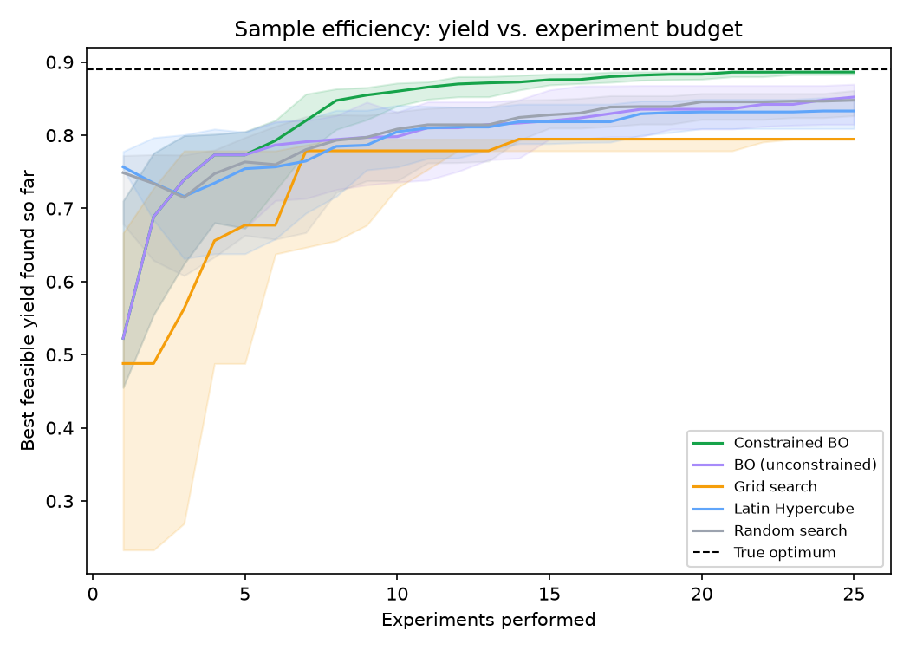
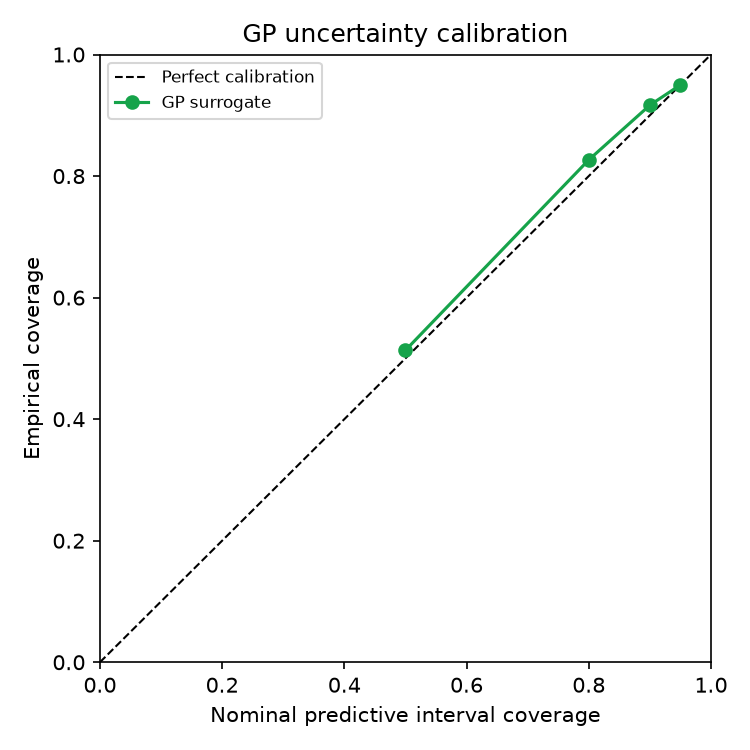
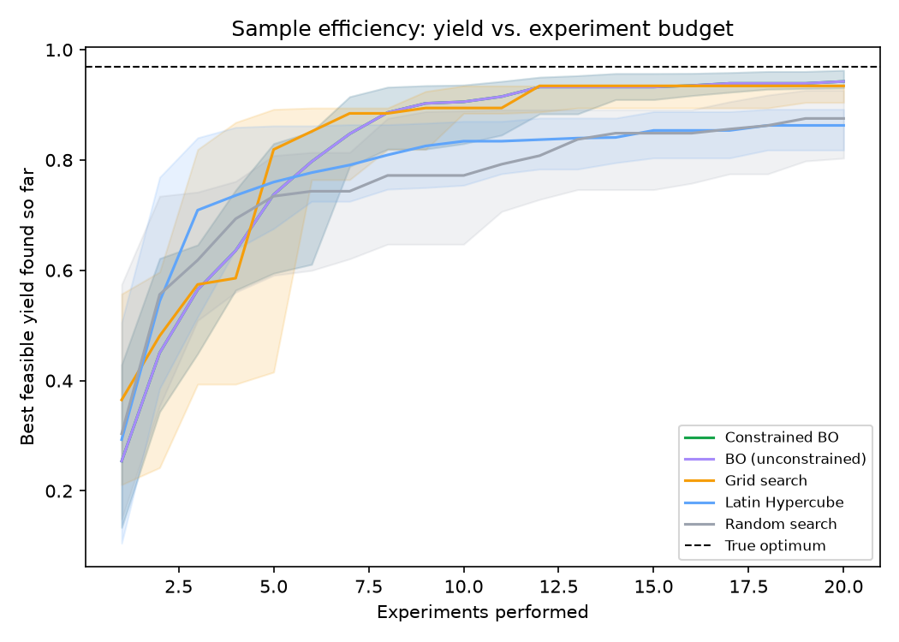
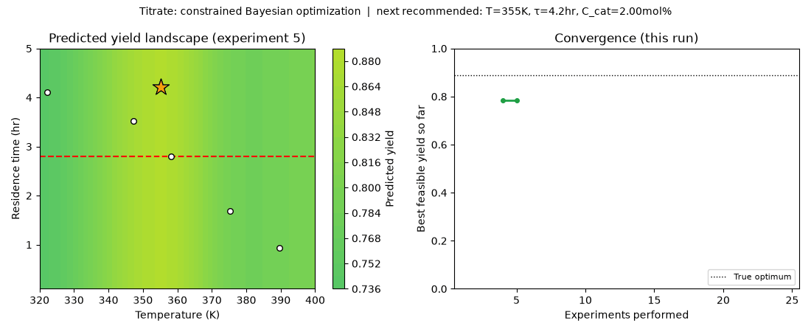

<p align="center">
  
</p>

# Titrate

[](https://github.com/mojaffri/titrate/actions/workflows/ci.yml)
[](https://www.python.org/)
[](LICENSE)

Titrate studies a practical experiment-design problem: how quickly can constrained Bayesian optimization find a high-yield operating condition when experiments are limited and some conditions violate a process specification?

The primary benchmark uses a steady-state CSTR simulator with Arrhenius kinetics, competing reactions, measurement noise, and a nonlinear impurity constraint. The same optimization code is also evaluated on published Suzuki-Miyaura reaction data through a Gaussian-process emulator.

**Live app:** [titrate.streamlit.app](https://titrate.streamlit.app/)

## Main result

Each strategy receives 25 experiments on the synthetic CSTR problem. The benchmark is repeated across 40 random seeds and scored against the simulator's noiseless response.

| Strategy | Median experiments to 90% | Median experiments to 95% | Median experiments to 99% | Median final yield (% of optimum) | Constraint violation rate |
|---|---:|---:|---:|---:|---:|
| Random search | 10 | 14 | never | 0.848 (95.3%) | 72.9% |
| Grid search | never | never | never | 0.795 (89.3%) | 55.6% |
| Latin Hypercube | 8 | 10 | never | 0.833 (93.7%) | 73.0% |
| BO, unconstrained | 8 | 12.5 | 19 | 0.852 (95.8%) | 83.3% |
| **BO, constrained** | **7** | **8** | **17** | **0.887 (99.6%)** | **36.3%** |

The constrained method reaches 95% of the known constrained optimum in a median of 8 experiments. Random search requires 14 and Latin Hypercube Sampling requires 10. Constrained BO reaches 90% of the optimum in all 40 seeds in the stored benchmark.



The full trial history is committed in [`results/benchmark_trials.csv`](results/benchmark_trials.csv). Per-run summaries are in [`results/benchmark_summary.csv`](results/benchmark_summary.csv), and the benchmark can be regenerated with [`experiments/run_benchmark.py`](experiments/run_benchmark.py).

## Chemical engineering model

The synthetic environment represents two parallel liquid-phase reactions in a steady-state CSTR:

```text
A -> B   desired product
A -> C   undesired byproduct
```

The rate constants follow Arrhenius temperature dependence. Catalyst loading promotes the desired pathway with a saturating response. Residence time changes conversion, while temperature changes both reaction rates and selectivity.

The optimization variables are:

- temperature;
- residence time;
- catalyst loading.

The objective is product yield. The nonlinear constraint limits impurity concentration.

```text
maximize   yield(T, tau, catalyst)
subject to impurity(T, tau, catalyst) <= impurity_max
           lower_bounds <= [T, tau, catalyst] <= upper_bounds
```

The current constrained optimum, computed offline with `scipy.optimize.differential_evolution`, has yield `0.8896` at `342.0 K`, `5.0 hr`, and `2.0 mol%` catalyst. The impurity constraint is active at that solution (`0.0500` with a limit of `0.05`). The optimizer under test never receives the location of this optimum.

The kinetics and reactor equations are implemented in [`src/titrate/physics/kinetics.py`](src/titrate/physics/kinetics.py) and [`src/titrate/physics/reactor.py`](src/titrate/physics/reactor.py).

## Bayesian optimization

Titrate fits one Gaussian process to observed yield and a second GP to the impurity response. Inputs are scaled before fitting, and the surrogate uses a Matérn 5/2 kernel.

Expected Improvement is implemented in [`src/titrate/optimization/acquisition.py`](src/titrate/optimization/acquisition.py). For the constrained case, the acquisition value is

```text
constrained_EI(x) = EI(x) * P(feasible at x)
```

[`src/titrate/optimization/bo_loop.py`](src/titrate/optimization/bo_loop.py) fits the surrogates, maximizes the acquisition function with multi-start L-BFGS-B, rejects near-duplicate recommendations, and falls back to a randomized candidate search if the local optimizer fails to return a usable point.

The first five observations come from a Latin Hypercube design. Every later observation is selected from the current surrogate models.

## Surrogate calibration

A separate calibration experiment fits the GP on 25 points and checks predictive intervals on 300 held-out points.

| Nominal interval | Empirical coverage |
|---|---:|
| 50% | 51.3% |
| 80% | 82.7% |
| 90% | 91.7% |
| 95% | 95.0% |



The calibration experiment is included because uncertainty quality directly affects Bayesian optimization. A low RMSE alone does not show whether the acquisition function is receiving useful uncertainty estimates.

## Published reaction data

The second benchmark uses measurements from Reizman et al., *Reaction Chemistry & Engineering* (2016), a Suzuki-Miyaura flow-chemistry study. The repository includes 96 published measurements with provenance documented in [`data/README.md`](data/README.md).

For the benchmark, the 37 measurements from the most sampled catalyst subset are used to fit a continuously queryable GP emulator over residence time, temperature, and catalyst loading. Five-fold cross-validation on those measurements gives an RMSE of 10.7 percentage points of yield.

The real-data benchmark uses 20 experiments and 30 random seeds:

| Strategy | Median experiments to 90% | Median final yield (% of emulator optimum) |
|---|---:|---:|
| Random search | 8 | 0.875 (90.4%) |
| Grid search | 6.5 | 0.934 (96.5%) |
| Latin Hypercube | 3.5 | 0.863 (89.1%) |
| BO, unconstrained | 8 | 0.943 (97.4%) |
| BO, constrained | 8 | 0.943 (97.4%) |



LHS and grid reach 90% sooner on this benchmark. The emulator optimum lies on a domain boundary, which favors space-filling designs that cover edges and corners early. Both BO variants finish with a higher median fraction of the emulator optimum. The constrained and unconstrained variants agree because this dataset does not contain an engineering constraint.

This result is kept separate from the synthetic benchmark because the two experiments answer different questions. The synthetic CSTR provides a known constrained ground truth. The published dataset provides a check against a measured chemistry dataset, with emulator error reported explicitly.

Regenerate it with:

```bash
python experiments/run_real_data_benchmark.py
```

## Interactive optimizer

The Streamlit app runs the package code used by the benchmarks. It supports three experiment sources:

- the CSTR simulator;
- the Suzuki-Miyaura emulator;
- a user-supplied CSV with numeric decision variables and an objective column.

For each recommendation the app reports the proposed condition, GP mean, GP uncertainty, expected improvement, and estimated feasibility. The plots update after each completed experiment.



Run the app locally:

```bash
pip install -r requirements.txt
streamlit run webapp/app.py
```

## Model Lab

`webapp/pages/1_Model_Lab.py` compares the Gaussian-process surrogate with a PyTorch model on held-out data. Both models are evaluated on the same observations. The page reports RMSE, MAE, R², predictive uncertainty, interval coverage, learning curves, and PyTorch training history.

The GP remains the default optimizer surrogate because the project focuses on experiment budgets measured in tens of observations. The PyTorch path is included to compare modeling behavior and to exercise the production inference stack.

## Serving and MLOps

The repository also contains a production-oriented inference path for the learned surrogate:

- FastAPI batch inference with validated inputs;
- Prometheus-compatible service and model metrics;
- rolling drift diagnostics;
- versioned model artifacts;
- optional MLflow tracking;
- non-root Docker execution;
- integration tests and container smoke tests;
- GitHub Actions workflows;
- AWS CloudFormation for ECR and App Runner;
- GitHub OIDC authentication for deployment.

The AWS workflow is manually triggered and restricted to `main`. The infrastructure files are a deployment path, not evidence that a permanent AWS service is running. Details are in [`docs/MLOPS.md`](docs/MLOPS.md).

## Repository layout

```text
src/titrate/
├── physics/          # Arrhenius kinetics and CSTR model
├── environments/     # common experiment interface
├── surrogate/        # GP and PyTorch surrogate models
├── optimization/     # acquisition functions and BO loop
├── baselines/        # random, grid and Latin Hypercube search
├── evaluation/       # benchmark metrics and plots
└── serving/          # API, metrics and drift monitoring
experiments/          # reproducible benchmark and training scripts
webapp/               # Streamlit optimizer and Model Lab
infra/aws/            # CloudFormation and deployment configuration
data/                 # published reaction data and provenance
results/              # committed benchmark outputs
tests/                # unit and integration tests
```

The `ExperimentEnvironment` interface in [`src/titrate/environments/base.py`](src/titrate/environments/base.py) keeps the optimizer independent of the experiment source. The synthetic reactor and published-data emulator both implement this interface.

## Reproduce the project

```bash
git clone https://github.com/mojaffri/titrate.git
cd titrate
python -m venv .venv
# Windows: .venv\Scripts\activate
# macOS/Linux: source .venv/bin/activate
pip install -r requirements.txt
pytest
python experiments/run_benchmark.py
python experiments/run_real_data_benchmark.py
```

Randomness is controlled with `numpy.random.default_rng`, so the stored trial-level benchmark data can be reproduced from the same code and seeds.

## Limitations

The primary benchmark is simulated. Its kinetic parameters are illustrative and were not fit to a specific chemical system. The reactor model is isothermal and uses two first-order parallel reactions. The optimization problem has three decision variables and one nonlinear process constraint.

The published-data benchmark uses a GP emulator because the original measurements form a fixed dataset. Its cross-validated prediction error is material, so results from that benchmark should be read as optimization performance on the fitted emulator rather than direct prospective laboratory performance.

The current BO implementation is sequential. Batch acquisition and multi-objective optimization are reasonable extensions, but they are not claimed as implemented here.

## License

MIT. See [`LICENSE`](LICENSE).
