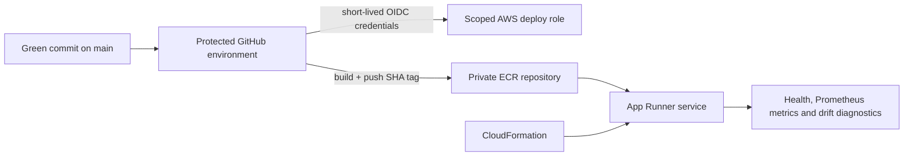

# Titrate ML Engineering and Deployment Workflow

Titrate includes a deployable deep-learning path without changing its scientific position: the Gaussian process remains the default small-data Bayesian-optimization model, while PyTorch is a scalable alternative for larger supervised datasets and production inference.

## 1. Inspect the GP vs PyTorch evidence

```bash
pip install -e ".[dev]"
streamlit run webapp/app.py
```

Open **Model Lab** in Streamlit's page navigation. The lab uses identical training rows and one untouched test split to compare:

- held-out RMSE, MAE, and R²;
- mean predictive uncertainty and empirical 95% interval coverage;
- nested learning curves showing error versus training-set size;
- PyTorch training/validation loss and early stopping; and
- interactive GP, PyTorch, and simulator predictions at the same operating condition.

The lab uses noiseless simulator values so it isolates surrogate approximation error. It does not replace the multi-seed BO benchmark, where the GP remains the acquisition model.

## 2. Train the PyTorch surrogate

```bash
pip install -e ".[dev,api,mlops]"
python experiments/train_torch_surrogate.py --samples 1500 --epochs 500
```

Outputs:

- `artifacts/torch_surrogate.pt` — serialized PyTorch model plus preprocessing metadata
- `results/torch_surrogate_metrics.json` — held-out RMSE, MAE, R², uncertainty and training metadata

The model uses an MLP with GELU activations and MC dropout. Inputs are scaled using physical process bounds and outputs are standardized during training. Early stopping uses a validation split.

## 3. Optional MLflow tracking

Point `MLFLOW_TRACKING_URI` at a local or hosted MLflow server before training:

```bash
export MLFLOW_TRACKING_URI=http://localhost:5000
python experiments/train_torch_surrogate.py
```

The training run logs parameters, held-out metrics, the model artifact and the metrics JSON under the `titrate-cstr-surrogate` experiment.

## 4. Serve the model locally

```bash
TITRATE_MODEL_PATH=artifacts/torch_surrogate.pt \
uvicorn titrate.serving.api:app --host 0.0.0.0 --port 8000
```

Endpoints:

- `GET /health`
- `GET /metadata`
- `GET /monitoring`
- `GET /metrics` (Prometheus text format)
- `POST /predict`

Example request:

```json
{
  "points": [[360.0, 2.0, 1.0]],
  "mc_samples": 100
}
```

The response includes both the predicted objective and predictive standard deviation.

The API limits inference batches to 256 points and rejects malformed, non-finite, or out-of-bounds inputs. Integration tests train and load a real artifact before exercising health, metadata, prediction, monitoring, metrics, and failure behavior.

## 5. Observability and drift monitoring

Every version-2 model artifact records the scaled feature mean and standard deviation of its training data. The service keeps only a bounded, thread-safe rolling window of recent inference inputs, predictions, and MC-dropout uncertainty. `GET /monitoring` reports:

- total predictions and current window size;
- rolling mean prediction and predictive uncertainty;
- per-feature standardized mean shift from the training reference;
- the maximum shift and whether it crossed the configured drift threshold.

Drift requires a minimum window size, so one interactive request does not create a false alert. Configure the process-local monitor with:

- `TITRATE_MONITOR_WINDOW` (default `2048` predictions);
- `TITRATE_DRIFT_MIN_SAMPLES` (default `25`); and
- `TITRATE_DRIFT_THRESHOLD` (default `0.75` training standard deviations).

`GET /metrics` exposes Prometheus-compatible request counts, request latency, prediction volume, uncertainty, monitoring-window size, drift score, and drift status. CI makes a prediction against the built container and verifies both monitoring endpoints.

The rolling window is intentionally process-local and bounded. In a multi-replica production deployment, scrape every replica into Prometheus/CloudWatch and compute durable fleet-level drift from centralized inference logs. Protect `/metrics` and `/monitoring` with private networking or an authenticated gateway before exposing a production service; they remain public in this portfolio scaffold so the behavior is inspectable.

## 6. Docker

The image trains a small deterministic model during the build, runs as a non-root user, and includes a container health check:

```bash
docker build -t titrate-api .
docker run -p 8000:8000 titrate-api
```

The container starts the FastAPI service with Uvicorn and is immediately healthy; no untracked local artifact is required. Override `MODEL_SAMPLES` and `MODEL_EPOCHS` as build arguments when needed. CI builds the image, starts it, and exercises health, metadata, prediction, drift diagnostics, and Prometheus metrics.

## 7. AWS App Runner deployment

The repository includes a real, manually triggered deployment workflow at `.github/workflows/deploy-aws.yml` and CloudFormation under `infra/aws/`. It uses GitHub OIDC, immutable commit-SHA image tags, ECR image scanning, App Runner health checks, and a post-deploy smoke test. No AWS access keys are stored in the repository.



### Validation without an AWS bill

The default CI path never authenticates to AWS and never creates resources. It:

1. validates every template with `cfn-lint`;
2. scans the CloudFormation with Checkov and fails on unapproved findings;
3. builds the exact deployment container;
4. starts it as a non-root user; and
5. smoke-tests health, metadata, prediction, monitoring and metrics over HTTP.

This is intentionally described as a **deployment-ready AWS architecture**, not as an always-on production service. A live deployment is optional evidence, not a requirement for reproducing the engineering work.

### One-time AWS bootstrap

Run this from an AWS administrator session. If the account already has GitHub's OIDC provider, pass its ARN through `ExistingGitHubOidcProviderArn`.

```bash
aws cloudformation deploy \
  --stack-name titrate-github-oidc \
  --template-file infra/aws/github-oidc-role.yml \
  --capabilities CAPABILITY_NAMED_IAM
```

Then create a protected GitHub environment named `aws-production`:

1. Save the stack's `DeployRoleArn` output as the environment secret `AWS_DEPLOY_ROLE_ARN`.
2. Optionally set the environment variable `AWS_REGION` (default: `us-east-1`).
3. Add required reviewers to the environment if the account supports them.

Optional but recommended: create the free monitoring-only AWS Budget from an administrator session. This budget is account-wide, because cost-allocation tags are not active automatically in a fresh account.

```bash
aws cloudformation deploy \
  --region us-east-1 \
  --stack-name titrate-cost-budget \
  --template-file infra/aws/budget.yml \
  --parameter-overrides NotificationEmail=you@example.com MonthlyBudgetUsd=5
```

It alerts at 50% and 80% of actual monthly spend and at 100% forecasted spend. Budget notifications can lag usage, so they are alerts rather than a hard spending cap.

### Deploy

Merge a green PR, then manually run **Deploy API to AWS App Runner** from `main`. The workflow:

1. exchanges GitHub's short-lived OIDC token for the scoped AWS role;
2. creates the `titrate-api` ECR repository if it does not exist;
3. builds and pushes an image tagged with the exact Git commit SHA;
4. deploys `infra/aws/apprunner.yml` through CloudFormation; and
5. waits for `/health` to return healthy.

Cost controls are conservative by default:

- App Runner can run at most one active instance unless `MaxInstances` is deliberately changed;
- automatic source deployments are disabled;
- ECR expires all but the five newest images;
- optional CloudWatch alarms are off by default because alarms can incur a small charge; and
- the service can be removed through the guarded teardown workflow when a demonstration ends.

### Tear down after a demonstration

Run **Tear down AWS portfolio deployment** manually from `main`, enter `delete-titrate`, and choose whether to delete the ECR images too. The workflow shares the deployment concurrency group, uses the protected `aws-production` environment and refuses to run from another branch. It deletes the App Runner CloudFormation stack first and only deletes ECR when the separate boolean input is enabled.

The one-time `titrate-github-oidc` bootstrap stack is intentionally retained so the deployment can be recreated. Delete that stack manually only when the repository will never deploy again.

The default 1-vCPU/2-GB App Runner service is **not free when left provisioned**. Pause or tear it down when it is not being demonstrated. The local application and CI evidence remain complete without any AWS deployment.

The workflow deliberately refuses to deploy from non-`main` refs. The repository does not claim a live AWS deployment until this bootstrap is completed and the workflow succeeds.

For larger production models, keep the same image/API contract but fetch a separately versioned artifact from S3 at startup and add CloudWatch alarms around latency, error rate, model-load failures, predictive uncertainty, and the exported drift score.

## Why both GP and PyTorch?

Titrate's Gaussian process is still the better default when experiment budgets are only tens of samples because it provides strong small-data behavior and calibrated posterior uncertainty. The PyTorch surrogate is intentionally an additional model for larger datasets, model-comparison experiments, deep-learning experience and production serving.
